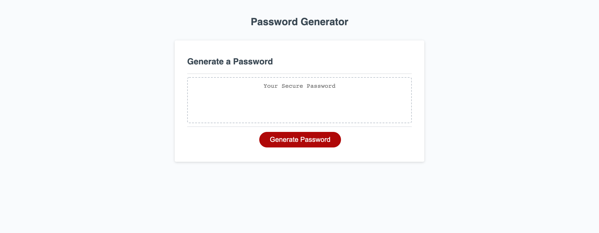

# easypasswordgenerator
webpages genertates random password when user selectes the 
following criterias, lenght between 8 and 128, numbers, lowercase
uppercase and symbols.  

[My Portofolio link](https://normaed11.github.io/easypasswordgenerator/)

